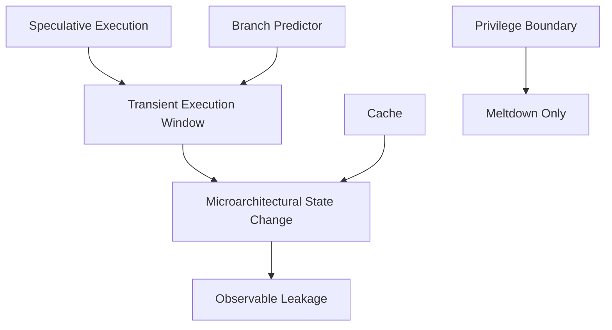

# Architectural Preconditions

!!! info "[Skip to TL;DR](#tldr)"

---

## Context

Meltdown and Spectre are not universally applicable vulnerabilities. Their feasibility depends on the presence of specific **microarchitectural and architectural features**.

"Three independent conditions must hold simultaneously for these attacks to be exploitable.[^1][^2]"

---

## Required Preconditions

| Precondition                             | Role in Attack                                            | Effect if Absent              |
| ---------------------------------------- | --------------------------------------------------------- | ----------------------------- |
| Speculative / Out-of-Order Execution     | Enables execution before instruction validity is resolved | No transient execution window |
| Hardware Branch Predictor                | Enables speculative control-flow redirection              | No controllable misprediction |
| Shared, Observable Cache                 | Provides timing-based leakage channel                     | No observable side-channel    |
| Privilege Separation (Meltdown-specific) | Defines protected vs unprotected memory regions           | No boundary to bypass         |

!!! Note
    The absence of any single required precondition is sufficient to invalidate the corresponding attack class.

---

## Precondition 1: Speculative / OoO Execution

### Role

* Enables execution of instructions **before architectural validation**
* Required for:
    * Meltdown → transient execution of faulting loads
    * Spectre → speculative execution of mispredicted branches

### Mechanism

* Instructions are issued and executed **out-of-order**
* Results are temporarily stored (e.g., in ROB)
* Commitment occurs only after validation

### Absence Effect

* Execution becomes strictly **in-order**
* Faulting instructions stall pipeline immediately
* No speculative side-effects are produced

??? warning
    Without speculative execution, both Meltdown and Spectre are fundamentally impossible.

---

## Precondition 2: Hardware Branch Predictor

### Role

* Predicts outcome of branches before resolution
* Enables speculative execution along predicted path

Required for:

* Spectre Variant 1 → bypass bounds checks
* Spectre Variant 2 → redirect indirect branches

### Mechanism

* Maintains prediction state (e.g., saturating counters, BTB)
* Uses historical execution patterns

### Absence Effect

* Branches resolve strictly before execution continues
* No speculative control-flow redirection possible

??? note
    A static or non-trainable predictor significantly reduces or eliminates Spectre attack surface.

---

## Precondition 3: Shared, Observable Cache

### Role

* Provides a **covert communication channel** between:
    * Transient execution (producer)
    * Attacker measurement (consumer)

Used by:

* Meltdown → encode leaked privileged data
* Spectre → encode speculatively accessed data

### Mechanism

* Cache state depends on memory access patterns
* Access latency differs between:
    * Cache hit
    * Cache miss

### Absence Effect

* No measurable timing difference
* No data exfiltration mechanism

??? warning
    Even if speculative execution exists, absence of a shared cache prevents observable leakage.

---

## Precondition 4: Privilege Separation (Meltdown-Specific)

### Role

* Defines **hardware-enforced memory isolation**
* Separates:
    * User space
    * Kernel space

Required for:

* Meltdown → cross-boundary data access

### Mechanism

* Page tables with permission bits (e.g., U/S bit)
* Memory Management Unit (MMU)
* Page fault exceptions on violation

### Absence Effect

* All memory is uniformly accessible
* No protected region exists
* No privilege violation possible

??? note
    Without a protection boundary, Meltdown has no target and becomes undefined.

---

## Dependency Structure

The attack surface can be viewed as an intersection of independent features:

---

## Interaction Between Preconditions

* Speculative execution alone → insufficient
* Cache alone → insufficient
* Branch prediction alone → insufficient

Attack feasibility emerges only when:

* **Execution** (speculation)
* **Isolation** (privilege or context boundary)
* **Observability** (cache timing)

are simultaneously present.

??? tip
    Vulnerabilities arise from the *composition* of features, not individual components.

---

## Architectural Minimalism vs Vulnerability

"From the analysis:[^1][^2][^8]"

* Removing **privilege separation** eliminates Meltdown
* Removing **branch prediction** eliminates Spectre
* Removing **cache observability** eliminates leakage

This highlights:

* Security can be achieved by **eliminating required conditions**
* Not all performance features are necessary for all system classes

---

## TL;DR

* Three core requirements:
    * Speculative execution
    * Branch prediction (Spectre)
    * Shared cache

* Additional requirement:
    * Privilege boundary (Meltdown only)

* If any required precondition is missing:
    * The attack becomes **non-instantiable**

* Vulnerability = intersection of:
    * Execution + Isolation + Observability

!!! info ""
    Architectural design choices directly determine whether transient execution attacks are possible.

---

[^1]: Lipp et al., *Meltdown*, USENIX Security 2018. [→ References](../references.md#ref-1)
[^2]: Kocher et al., *Spectre Attacks*, IEEE S&P 2019. [→ References](../references.md#ref-2)
[^8]: Patterson & Hennessy, *Computer Organization and Design: RISC-V Edition*, 2017. [→ References](../references.md#ref-8)