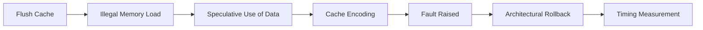

# Meltdown

!!! info "[Skip to TL;DR](#tldr)"

---

## Definition

Meltdown (CVE-2017-5754) is a **transient execution attack** that exploits the delay between:

* **Speculative execution of instructions**
* **Enforcement of memory access permissions**

It allows an unprivileged context to **read privileged memory** by leveraging microarchitectural side-effects, primarily cache state changes.

---

## Root Cause

Modern processors perform **out-of-order (OoO) execution** to improve performance. Instructions are executed before it is fully verified whether they are:

* Architecturally valid
* Permitted by privilege rules

For a memory load:

1. The CPU issues the load
2. Permission checks (via MMU/page tables) are still in progress
3. Dependent instructions may execute speculatively

If the access is illegal:

* A **fault is eventually raised**
* Architectural state is rolled back
* **Microarchitectural state is not reverted**

This creates a **transient window** where unauthorized data is usable.

??? note
    The vulnerability arises from the lack of synchronization between data access and permission validation.

---

## Execution Flow

Meltdown operates in four stages:



---

## Step-by-Step Mechanism

### 1. Cache Preparation

The attacker evicts a probe array from the cache:

* Ensures all accesses result in **cache misses** initially
* Provides a clean baseline for timing measurement

---

### 2. Faulting Load

A load instruction targets a **privileged address**:

* Example: kernel virtual address
* Access violates privilege rules

However:

* The load may still return data transiently
* Execution continues speculatively

---

### 3. Transient Execution

The loaded value is used in dependent instructions:

* Typically as an index into a probe array
* Example:

  ```c
  temp = probe_array[secret * 512];
  ```

This causes:

* A specific cache line to be loaded
* Encoding of the secret into cache state

---

### 4. Exception and Rollback

* The CPU detects the illegal access
* Raises a **page fault exception**
* Flushes pipeline and restores architectural state

??? note
    The cache modification caused during speculative execution is not reverted.

---

### 5. Data Exfiltration

The attacker measures access time to probe array entries:

* Cache hit → low latency (~L1 access)
* Cache miss → high latency (DRAM access)

The fastest access reveals the secret value.

---

## Required Architectural Conditions

Meltdown requires all of the following:

| Requirement            | Role                                                  |
| ---------------------- | ----------------------------------------------------- |
| Out-of-order execution | Enables speculative execution before fault resolution |
| Virtual memory (MMU)   | Defines protected vs unprotected regions              |
| Privilege levels       | Enforces access restrictions                          |
| Page fault mechanism   | Delays fault handling                                 |
| Shared cache           | Enables side-channel leakage                          |

??? warning
    Absence of any of these conditions prevents Meltdown from being instantiated.

---

## Affected Systems

Meltdown primarily affects:

* Intel processors (post-1995, OoO-based)
* Selected ARM cores (with similar execution behavior)

Processors with:

* Strict in-order execution
* Early permission checks
* No shared cache

are generally not vulnerable.

---

## Key Property

The defining characteristic of Meltdown is:

> **Unauthorized data is transiently accessible before the CPU enforces access control.**

This is not a software bug but a consequence of:

* Microarchitectural optimization
* Deferred exception handling

---

## Limitations

Meltdown specifically targets:

* **Cross-privilege data leakage** (user → kernel)

It does not inherently:

* Require branch prediction
* Depend on attacker-controlled victim code
* Operate across identical privilege domains

---

## TL;DR

* Exploits **delay between speculative execution and permission checks**
* Reads **privileged memory from unprivileged context**
* Uses **cache timing side-channel** for data exfiltration
* Requires:
    * OoO execution
    * Virtual memory + page tables
    * Privilege separation

* Not applicable in systems **without hardware-enforced memory protection**


!!! info ""
    Meltdown is fundamentally a privilege boundary violation enabled by transient execution, not merely a cache side-channel attack.

---
