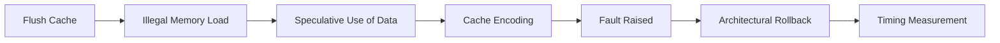

# Meltdown

!!! info "[Skip to TL;DR](#tldr)"

---

## Definition

Meltdown (CVE-2017-5754) is a **transient execution attack** that exploits the delay between speculative execution of instructions and enforcement of memory access permissions.[^1]

It allows an unprivileged context to **read privileged memory** by leveraging microarchitectural side-effects — primarily cache state changes.[^1]

---

## Root Cause

Modern processors perform **out-of-order (OoO) execution** to improve performance[^8]. Instructions are executed before it is fully verified whether they are:

* Architecturally valid
* Permitted by privilege rules

For a memory load:

1. The CPU issues the load
2. Permission checks (via MMU/page tables) are still in progress
3. Dependent instructions may execute speculatively

If the access is illegal:

* A **fault is eventually raised**
* Architectural state is rolled back
* **Microarchitectural state is not reverted**[^1]

This creates a **transient window** where unauthorized data is usable.

??? note
    The vulnerability arises from the lack of synchronization between data access and permission validation.[^1]

---

## Execution Flow

Meltdown operates in four stages:



---

## Step-by-Step Mechanism

### 1. Cache Preparation

The attacker evicts a probe array from the cache:

* Ensures all accesses result in **cache misses** initially
* Provides a clean baseline for timing measurement

---

### 2. Faulting Load

A load instruction targets a **privileged address**:

* Example: kernel virtual address
* Access violates privilege rules

However:

* The load may still return data transiently
* Execution continues speculatively

---

### 3. Transient Execution

The loaded value is used in dependent instructions:

* Typically as an index into a probe array
* Example:

  ```c
  temp = probe_array[secret * 512];
  ```

This causes:

* A specific cache line to be loaded
* Encoding of the secret into cache state

---

### 4. Exception and Rollback

* The CPU detects the illegal access
* Raises a **page fault exception**
* Flushes pipeline and restores architectural state

??? note
    The cache modification caused during speculative execution is not reverted.

---

### 5. Data Exfiltration

The attacker measures access time to probe array entries:

* Cache hit → low latency (~L1 access)
* Cache miss → high latency (DRAM access)

The fastest access reveals the secret value.

## Demonstration

<div class="meltdown-sim">

<style>
.meltdown-sim {
  font-family: var(--md-text-font);
  margin: 1.5rem 0;
}

/* Header */
.topbar {
  display:flex;
  justify-content:space-between;
  align-items:center;
  margin-bottom:10px;
}

.badge {
  padding:4px 8px;
  border-radius:6px;
  font-size:11px;
}

.perm-ok { background:#2e7d32; color:white; }
.perm-wait { background:#f9a825; color:black; }
.perm-fault { background:#c62828; color:white; }

/* Toggle */
.toggle {
  cursor:pointer;
  padding:4px 10px;
  border-radius:6px;
  background: var(--md-primary-fg-color);
  color: var(--md-primary-bg-color);
}

/* Pipeline */
.pipeline {
  display:grid;
  grid-template-columns: repeat(6,1fr);
  gap:8px;
}

.stage {
  border:1px solid var(--md-default-fg-color--light);
  border-radius:8px;
  padding:8px;
  min-height:70px;
  text-align:center;
  transition: all 0.3s ease;
}

.stage.perm {
  border-color:#f9a825;
}

/* Titles */
.title {
  font-size:11px;
  font-weight:bold;
}

/* Instruction */
.inst {
  font-size:11px;
  margin-top:5px;
  padding:4px;
  border-radius:4px;
  background: var(--md-primary-fg-color--light);
  color: var(--md-primary-bg-color);
  transition: transform 0.2s;
}

/* Secret */
.secret {
  background:#ffebee;
  border:1px solid #e53935;
}

/* Trigger */
.trigger {
  border:2px solid #e53935;
  transform: scale(1.05);
}

/* Popup */
.popup {
  margin-top:10px;
  padding:10px;
  border-radius:8px;
  background: var(--md-code-bg-color);
  font-size:12px;
  animation: fade 0.3s ease;
}

@keyframes fade {
  from {opacity:0; transform:translateY(-5px);}
  to {opacity:1;}
}

/* Controls */
.controls {
  margin-top:10px;
  display:flex;
  gap:8px;
}
.controls button {
  border:none;
  padding:6px 10px;
  border-radius:6px;
  background: var(--md-primary-fg-color);
  color: var(--md-primary-bg-color);
  cursor:pointer;
}
</style>

<div class="topbar">
  <div><b>Cycle:</b> <span id="cycle">0</span></div>
  <div>
    <span id="permBadge" class="badge perm-wait">Checking</span>
    <span class="toggle" onclick="toggleMode()">Mode: <span id="mode">ATTACK</span></span>
  </div>
</div>

<div class="pipeline" id="pipe"></div>

<div class="popup" id="popup">
Click ▶ to start simulation
</div>

<div class="controls">
  <button onclick="prev()">⏮</button>
  <button onclick="auto()">▶</button>
  <button onclick="next()">⏭</button>
  <button onclick="reset()">🔁</button>
</div>

<script>
const stages = ["IF","ID","EX","MEM","WB","PERM"];

let cycle = 0;
let timer = null;
let attackMode = true;

/* Timeline (Attack vs Normal) */
const attackTimeline = [
 ["Load","","","","",""],
 ["","Load","","","","Check"],
 ["","","Load","","","Checking"],
 ["","","","Load(secret)","","Pending"],
 ["","","","","Encode","Pending"],
 ["","","","","","FAULT"],
];

const normalTimeline = [
 ["Load","","","","",""],
 ["","Load","","","","Check"],
 ["","","Load","","","GRANTED"],
 ["","","","Blocked","","DONE"],
];

const explainAttack = [
 "Fetch load instruction",
 "Decode + permission starts",
 "Pipeline continues",
 "⚠ Secret loaded BEFORE permission check",
 "Secret encoded into cache",
 "Fault raised → too late"
];

const explainNormal = [
 "Fetch instruction",
 "Decode + permission",
 "Permission resolved EARLY",
 "Access blocked → no leak"
];

function render(){
  let timeline = attackMode ? attackTimeline : normalTimeline;
  let explain = attackMode ? explainAttack : explainNormal;

  const pipe = document.getElementById("pipe");
  pipe.innerHTML="";

  for(let i=0;i<stages.length;i++){
    let cell = document.createElement("div");
    cell.className = "stage";
    if(stages[i]==="PERM") cell.classList.add("perm");

    let content = timeline[cycle]?.[i] || "";

    let cls="";
    if(content.includes("secret")) cls="secret";
    if(attackMode && cycle===3 && i===3) cls="trigger";

    cell.innerHTML = `<div class="title">${stages[i]}</div>
                      <div class="inst ${cls}">${content}</div>`;

    pipe.appendChild(cell);
  }

  document.getElementById("cycle").innerText = cycle;

  /* Permission badge */
  let perm = timeline[cycle]?.[5] || "";
  let badge = document.getElementById("permBadge");

  if(perm.includes("FAULT")){
    badge.className="badge perm-fault";
    badge.innerText="FAULT";
  }
  else if(perm.includes("GRANTED")){
    badge.className="badge perm-ok";
    badge.innerText="GRANTED";
  }
  else{
    badge.className="badge perm-wait";
    badge.innerText="Checking";
  }

  document.getElementById("popup").innerText = explain[cycle] || "";
}

function next(){
  let max = (attackMode ? attackTimeline.length : normalTimeline.length)-1;
  if(cycle < max) cycle++;
  render();
}

function prev(){
  if(cycle>0) cycle--;
  render();
}

function reset(){
  cycle=0;
  render();
}

function auto(){
  if(timer){
    clearInterval(timer);
    timer=null;
    return;
  }
  timer=setInterval(()=>{
    next();
  },1200);
}

function toggleMode(){
  attackMode = !attackMode;
  document.getElementById("mode").innerText = attackMode ? "ATTACK" : "NORMAL";
  reset();
}

render();
</script>

</div>

---

## Required Architectural Conditions

Meltdown requires all of the following[^1][^5]:

| Requirement            | Role                                                  |
| ---------------------- | ----------------------------------------------------- |
| Out-of-order execution | Enables speculative execution before fault resolution |
| Virtual memory (MMU)   | Defines protected vs unprotected regions              |
| Privilege levels       | Enforces access restrictions                          |
| Page fault mechanism   | Delays fault handling                                 |
| Shared cache           | Enables side-channel leakage                          |

??? warning
    Absence of any of these conditions prevents Meltdown from being instantiated.

---

## Affected Systems

Meltdown primarily affects[^1][^5][^7]:

* Intel processors (post-1995, OoO-based)
* Selected ARM cores (with similar execution behavior)[^7]

Processors with:

* Strict in-order execution
* Early permission checks
* No shared cache

are generally not vulnerable[^8].

---

## Key Property

The defining characteristic of Meltdown is:

> **Unauthorized data is transiently accessible before the CPU enforces access control[^1].**

This is not a software bug but a consequence of:

* Microarchitectural optimization
* Deferred exception handling

---

## Limitations

Meltdown specifically targets:

* **Cross-privilege data leakage** (user → kernel)

It does not inherently:

* Require branch prediction
* Depend on attacker-controlled victim code
* Operate across identical privilege domains

---

## TL;DR

* Exploits **delay between speculative execution and permission checks**
* Reads **privileged memory from unprivileged context**
* Uses **cache timing side-channel** for data exfiltration[^1][^2]
* Requires:
    * OoO execution
    * Virtual memory + page tables
    * Privilege separation

* Not applicable in systems **without hardware-enforced memory protection**


!!! info ""
    Meltdown is fundamentally a privilege boundary violation enabled by transient execution, not merely a cache side-channel attack.

---

[^1]: Lipp et al., *Meltdown: Reading Kernel Memory from User Space*, USENIX Security 2018. [→ References](../references.md#ref-1)
[^2]: Kocher et al., *Spectre Attacks: Exploiting Speculative Execution*, IEEE S&P 2019. [→ References](../references.md#ref-2)
[^3]: RISC-V International, *Privileged Architecture Manual v20211203*. [→ References](../references.md#ref-3)
[^4]: RISC-V International, *Zicbom Extension v1.0*. [→ References](../references.md#ref-4)
[^5]: Intel Corporation, *Analysis of Speculative Execution Side Channels*, 2018. [→ References](../references.md#ref-5)
[^7]: ARM Limited, *Cache Speculation Side-channels*, 2018. [→ References](../references.md#ref-7)
[^8]: Patterson & Hennessy, *Computer Organization and Design: RISC-V Edition*, 2017. [→ References](../references.md#ref-8)
