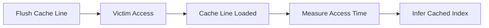

# Cache Timing Side-Channel

!!! info "[Skip to TL;DR](#tldr)"

---

## Definition

A cache timing side-channel is a **microarchitectural leakage mechanism** that exposes information through **timing differences in memory access latency**[^1][^2].

It is the primary **data exfiltration channel** used by both Meltdown and Spectre .

---

## Core Principle[^8]

Memory access latency depends on where the data resides:

| Location | Typical Latency |
| -------- | --------------- |
| L1 Cache | ~4–15 cycles    |
| DRAM     | ~150–300 cycles |

This timing difference is:

* Measurable via high-resolution timers
* Deterministic enough to encode information[^8]

??? note
    The attacker does not read data directly; instead, it infers data based on access time.

---

## Information Encoding Mechanism

Sensitive data is encoded into cache state using a **probe array**:

```c
temp = probe_array[secret * STRIDE];
```

* `secret` determines which cache line is accessed
* That cache line becomes **resident (cached)**
* Other lines remain uncached

This creates a **one-to-one mapping between secret value and cache state**

---

## Flush+Reload Technique

The most commonly used technique is **Flush+Reload** .

### Execution Flow



---

### Step-by-Step

#### 1. Flush Phase

* Attacker evicts probe array from cache
* On x86: `clflush`
* On RISC-V: `cbo.inval` (Zicbom) or eviction loop

---

#### 2. Victim / Speculative Access

* Victim or transient execution accesses:

```c
probe_array[secret * STRIDE];
```

* Corresponding cache line is loaded

---

#### 3. Reload Phase

* Attacker measures access time for each index:

```c
uint64_t t0, t1;
asm volatile ("rdcycle %0" : "=r"(t0));
volatile uint8_t val = probe_array[i * STRIDE];
asm volatile ("rdcycle %0" : "=r"(t1));

latency = t1 - t0;
```

* Fast access → cache hit
* Slow access → cache miss

---

#### 4. Secret Recovery

* Index with lowest latency corresponds to `secret`

??? tip
    Only one cache line is significantly faster, enabling reliable identification of the encoded value.

---

## Why It Works

The attack relies on a fundamental asymmetry:

* **Architectural state** is rolled back after faults or misprediction
* **Microarchitectural state (cache)** is not

??? warning
    Cache contents persist even if the instruction that caused the access is never committed.

This property enables:

* Meltdown → leak across privilege boundary
* Spectre → leak across control-flow boundary

## Flush+Reload — Interactive Walkthrough [^6]

<!-- INTERACTIVE: animated Flush+Reload with probe array visualization -->
<div style="font-family:var(--md-text-font);margin:1rem 0">
<style>
.fr-stage{padding:12px 14px;border-radius:8px;border:1.5px solid #ddd;margin-bottom:8px;transition:all .3s}
.fr-stage.fr-active{border-color:#1976d2;background:#e3f2fd}
.fr-stage.fr-done{border-color:#43a047;background:#f1f8e9}
.fr-stage-title{font-size:12px;font-weight:600;margin-bottom:4px}
.fr-stage-body{font-size:11px;color:#555;line-height:1.5}
.probe-grid{display:flex;flex-wrap:wrap;gap:3px;margin:8px 0}
.probe-cell{width:22px;height:22px;border-radius:3px;display:flex;align-items:center;justify-content:center;font-size:9px;font-weight:600;transition:all .3s;border:1px solid #ccc;background:#eee;color:#999}
.probe-cell.hot{background:#e53935;border-color:#b71c1c;color:#fff}
.probe-cell.cold{background:#eee;border-color:#ccc;color:#bbb}
.probe-cell.probing{background:#7b1fa2;border-color:#4a148c;color:#fff}
.fr-nav{display:flex;gap:8px;margin-top:10px}
.fr-nbtn{padding:5px 16px;border-radius:5px;border:1px solid #ddd;background:#f5f5f5;font-size:12px;cursor:pointer}
.fr-nbtn:hover{background:#e0e0e0}
.timing-bars{display:flex;flex-direction:column;gap:3px;margin:8px 0}
.t-bar-row{display:flex;align-items:center;gap:6px;font-size:10px}
.t-bar-label{width:32px;text-align:right;color:#666}
.t-bar-track{flex:1;background:#eee;border-radius:2px;height:14px;overflow:hidden}
.t-bar-fill{height:100%;border-radius:2px;display:flex;align-items:center;padding-left:4px;font-size:9px;font-weight:600;transition:width .4s}
</style>

<div id="fr-content"></div>

<script>
var frStep=0;
var secret=65;
var frStages=[
  {title:"1 — Flush: evict probe array from all cache levels",
   body:"All 256 entries of probe_array are evicted using clflush (x86) or cbo.inval (RISC-V Zicbom). Starting state: all cache lines cold.",
   code:"for(int i=0;i<256;i++) clflush(&probe_array[i*512]); // [4]",
   cells:"cold", highlight:-1, timing:false},
  {title:"2 — Victim accesses secret → probe_array[secret × 512]",
   body:"Victim (or speculative path) reads a secret byte (value=65=0x41='A') and uses it to index probe_array. Cache line at index 65 is loaded into L1.",
   code:"uint8_t s = secret_mem[x]; // secret = 65\ntemp = probe_array[s * 512]; // loads cache line 65",
   cells:"hot", highlight:secret, timing:false},
  {title:"3 — Reload: time access to all 256 entries",
   body:"Attacker reads every probe_array entry and measures latency with rdcycle. Entry 65 returns fast (~4 cy). All others return slow (~250 cy DRAM).",
   code:"for(int i=0;i<256;i++){\n  t0=rdcycle(); dummy=probe_array[i*512]; t1=rdcycle();\n  times[i]=t1-t0;\n}",
   cells:"probing", highlight:secret, timing:true},
  {title:"4 — Recover: minimum latency index = secret byte",
   body:"Entry 65 had the lowest latency → secret = 65 = 0x41 = 'A'. Repeat for each byte position to reconstruct arbitrary memory.",
   code:"int secret=0;\nfor(int i=0;i<256;i++)\n  if(times[i]<THRESHOLD) secret=i;\n// secret == 65",
   cells:"done", highlight:secret, timing:true}
];

function frRender(){
  var s=frStages[frStep];
  var html='';

  // Stage indicator
  html+='<div style="font-size:11px;color:#888;margin-bottom:8px">Step '+(frStep+1)+' of '+frStages.length+': <strong style="color:#1976d2">'+s.title+'</strong></div>';

  // Body
  html+='<div style="font-size:12px;color:#444;margin-bottom:8px;line-height:1.5">'+s.body+'</div>';

  // Code
  html+='<pre style="background:rgba(0,0,0,.05);border-radius:6px;padding:8px 10px;font-size:11px;margin-bottom:10px;overflow-x:auto">'+s.code+'</pre>';

  // Probe grid (show 32 cells representing 0..255 in steps of 8)
  html+='<div style="font-size:10px;color:#888;margin-bottom:4px">Probe array cache state (32 of 256 entries shown, step=8):</div>';
  html+='<div class="probe-grid">';
  for(var i=0;i<32;i++){
    var idx=i*8;
    var ishot=(idx===secret||Math.abs(idx-secret)<=4);
    var cls='cold';
    if(s.cells==='hot'&&ishot) cls='hot';
    else if(s.cells==='probing') cls=(ishot?'hot':'probing');
    else if(s.cells==='done') cls=(ishot?'hot':'cold');
    html+='<div class="probe-cell '+cls+'">'+(ishot&&frStep>=1?'65':idx)+'</div>';
  }
  html+='</div>';

  // Timing bars (steps 2+)
  if(s.timing){
    html+='<div style="font-size:10px;color:#888;margin:6px 0 4px">Access timing (selected indices):</div>';
    html+='<div class="timing-bars">';
    var show=[0,8,16,24,32,40,48,56,64,65,72,80,96,128,192];
    show.forEach(function(idx){
      var ishit=(idx===secret);
      var t=ishit?4:220+Math.floor(Math.random()*60);
      var w=Math.round(Math.min(t,300)/300*100);
      html+='<div class="t-bar-row"><div class="t-bar-label">['+idx+']</div><div class="t-bar-track"><div class="t-bar-fill" style="width:'+w+'%;background:'+(ishit?'#43a047':'#90a4ae')+'"><span style="color:#fff">'+(ishit?t+' cy HIT':t+' cy')+'</span></div></div></div>';
    });
    html+='</div>';
  }

  // Nav
  html+='<div class="fr-nav"><button class="fr-nbtn" onclick="frNav(-1)" '+(frStep===0?'disabled':'')+'>← Back</button><button class="fr-nbtn" onclick="frNav(1)" '+(frStep===frStages.length-1?'disabled':'')+'>Next →</button></div>';

  document.getElementById('fr-content').innerHTML=html;
}
function frNav(d){frStep=Math.max(0,Math.min(frStages.length-1,frStep+d));frRender();}
frRender();
</script>
</div>

---

## Alternative Techniques[^6]

While Flush+Reload requires shared memory, other techniques exist:

### Prime+Probe

* Attacker fills cache sets (prime)
* Victim evicts lines
* Attacker measures which sets were evicted

### Flush+Flush[^6]

* Measures time taken to flush cache lines
* Faster and stealthier than Flush+Reload

??? note
    These techniques do not require shared memory, making them applicable in broader scenarios.

---

## Why the Side-Channel Persists [^1][^2]

The attack exploits an asymmetry:

| State | Rolled back after fault/misprediction? |
| --- | --- |
| Architectural (registers, PC) | **Yes** |
| Microarchitectural (cache contents) | **No** |

Cache contents persist even if the instruction that caused the access was never committed. This is the fundamental property both attacks rely on.

---

## RISC-V Specific Considerations [^3][^4]

```c
// rdcycle is accessible from unprivileged mode by default [3]
// Access restricted via mcounteren.CY = 0
uint64_t t0, t1;
asm volatile ("rdcycle %0" : "=r"(t0));
volatile uint8_t val = probe_array[i * 512];
asm volatile ("rdcycle %0" : "=r"(t1));
uint64_t latency = t1 - t0;
// < 15 cycles → cache hit; > 150 cycles → DRAM miss
```

The `rdcycle` CSR provides the same timing resolution as x86 `rdtsc`. Access is controllable via `mcounteren` CSR.[^3]

---

Typical threshold:

* Cache hit: < ~15 cycles
* Cache miss: > ~150 cycles

??? warning
    The `rdcycle` CSR is accessible in unprivileged mode unless explicitly restricted, enabling high-resolution timing attacks.

---

## Required Conditions

A cache timing side-channel requires:

| Condition                    | Role                                   |
| ---------------------------- | -------------------------------------- |
| Shared cache                 | Enables observation of victim activity |
| Timing source                | Measures access latency[^3]                |
| Deterministic cache behavior | Ensures repeatability                  |
| Data-dependent memory access | Encodes secret into cache              |

---

## Limitations

The channel depends on:

* Noise (interrupts, scheduling)
* Cache associativity and replacement policy
* Timer resolution

It does not:

* Provide direct memory access
* Work without a measurable timing difference

---

## Role in Meltdown and Spectre

| Attack   | Role of Side-Channel                          |
| -------- | --------------------------------------------- |
| Meltdown[^1] | Extracts transiently accessed privileged data |
| Spectre[^2]  | Extracts speculatively accessed data          |

??? info
    The side-channel is not the vulnerability itself; it is the mechanism that converts transient execution effects into observable data.

---

## Architectural Insight

The vulnerability arises from:

* Performance optimizations (caching, speculation)
* Lack of rollback for microarchitectural state

This creates a persistent channel:

* Invisible at ISA level
* Observable via timing

---

## TL;DR

* Cache timing side-channel leaks data via **access latency differences**(L1 ~4 cy vs DRAM ~250 cy) [^8]
* Uses techniques like **Flush+Reload**[^1][^2]
* Alternative: **Prime+Probe** (no shared memory needed)[^6]
* Cache state is **not rolled back** after speculative execution
* RISC-V: `rdcycle` provides required timer resolution [^3]

!!! info ""
    The cache acts as a covert communication channel between transient execution and attacker observation.[^1][^2]

---

[^1]: Lipp et al., *Meltdown*, USENIX Security 2018. [→ References](../references.md#ref-1)
[^2]: Kocher et al., *Spectre Attacks*, IEEE S&P 2019. [→ References](../references.md#ref-2)
[^3]: RISC-V International, *Privileged Architecture Manual v20211203*. [→ References](../references.md#ref-3)
[^4]: RISC-V International, *Zicbom Extension v1.0*. [→ References](../references.md#ref-4)
[^6]: Gruss et al., *Flush+Flush: A Fast and Stealthy Cache Attack*, DIMVA 2016. [→ References](../references.md#ref-6)
[^8]: Patterson & Hennessy, *Computer Organization and Design: RISC-V Edition*, 2017. [→ References](../references.md#ref-8)