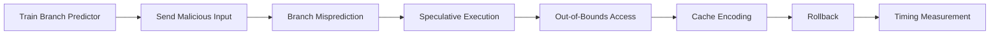

# Spectre

!!! info "[Skip to TL;DR](#tldr)"

---

## Definition

Spectre is a class of **transient execution attacks** that exploit **speculative execution triggered by branch misprediction**.[^2]

Unlike Meltdown, Spectre does not require a privilege violation. Instead, it causes a victim to **speculatively execute unintended instructions**, which leak sensitive data through microarchitectural side-effects.[^2]

---

## Root Cause

Modern processors use **branch prediction** to improve performance:

* Predict the outcome of conditional branches
* Speculatively execute instructions before the branch resolves

If the prediction is incorrect:

* Speculative results are discarded architecturally
* **Microarchitectural side-effects remain**[^2]

This allows an attacker to:

* Influence the prediction mechanism
* Control speculative execution paths
* Extract data via cache timing

??? note
    Spectre exploits *correctly implemented* performance optimizations rather than violating access permissions.[^2]

---

## Spectre Variants

### Variant 1 — Bounds Check Bypass (CVE-2017-5753)[^2]

* Exploits conditional branches (e.g., bounds checks)
* Trains predictor to assume branch is always taken
* Causes speculative execution of out-of-bounds access

---

### Variant 2 — Branch Target Injection (CVE-2017-5715)[^2]

* Exploits indirect branch prediction (BTB poisoning)
* Redirects speculative execution to attacker-controlled gadgets
* Enables cross-context data leakage

??? note
    Variant 1 operates within the same context. Variant 2 targets cross-context or cross-privilege execution.

---

## Execution Flow (Variant 1)



---

## Variant 1: Step-by-Step

### Victim gadget

```c
if (x < array1_size) {           // bounds check — attacker trains this branch
    uint8_t val = array1[x];     // x is attacker-controlled index
    temp = probe_array[val * 512]; // encodes val into cache state
}
```

### Execution steps

| Step | Action | Result |
| --- | --- | --- |
| 1 | Call victim with valid `x` ~30× | Predictor → Strongly Taken |
| 2 | Call victim with out-of-bounds `x` | Predictor: taken (misprediction) |
| 3 | Speculative: `array1[x]` reads secret | Cache line loaded for secret-indexed probe entry |
| 4 | Branch resolves false → ROB flush | Registers reverted; cache NOT reverted |
| 5 | Attacker times all 256 probe entries | Fast entry reveals secret byte [^2] |

### Timing measurement (RISC-V) [^3][^4]

```c
uint64_t t0, t1;
asm volatile ("rdcycle %0" : "=r"(t0));
volatile uint8_t v = probe_array[i * 512];
asm volatile ("rdcycle %0" : "=r"(t1));
// t1 - t0 < threshold → cache hit → this index = secret
```

---

## Variant 2: Branch Target Injection — High Level [^2]

1. Attacker poisons Branch Target Buffer (BTB) with malicious target address
2. Victim executes indirect branch
3. Predictor redirects speculatively to attacker-chosen gadget
4. Gadget accesses sensitive data → cache encodes it
5. Attacker extracts via timing

??? warning
    Variant 2 enables cross-context attacks (user → kernel). Requires shared predictor state across privilege levels.[^2][^5]

---

## Branch Predictor: 2-Bit Saturating Counter — Interactive

<!-- INTERACTIVE: 2-bit state machine — replaces static description -->
<div style="font-family:var(--md-text-font);margin:1rem 0">
<style>
.bp-states{display:flex;gap:8px;align-items:center;flex-wrap:wrap;margin-bottom:12px}
.bp-state{width:120px;padding:10px 8px;border-radius:8px;text-align:center;border:2px solid transparent;transition:all .25s;cursor:default}
.bp-state.active-state{transform:scale(1.08)}
.bp-label{font-size:11px;font-weight:600;margin-bottom:2px}
.bp-sublabel{font-size:10px}
.bp-arrow{font-size:18px;color:#999;flex-shrink:0}
.bp-predict{font-size:12px;padding:4px 10px;border-radius:20px;font-weight:600;display:inline-block;margin-top:4px}
.bp-controls{display:flex;gap:8px;margin:10px 0}
.bp-btn2{padding:6px 18px;border-radius:6px;border:none;font-size:12px;font-weight:600;cursor:pointer;transition:background .15s}
.bp-taken{background:#43a047;color:#fff}
.bp-taken:hover{background:#388e3c}
.bp-nottaken{background:#e53935;color:#fff}
.bp-nottaken:hover{background:#c62828}
.bp-log{font-size:11px;color:#666;margin-top:8px;max-height:80px;overflow-y:auto;padding:6px 8px;background:rgba(0,0,0,.04);border-radius:6px}
</style>
<div class="bp-states" id="bp-states">
  <div class="bp-state" id="bps0" style="background:#ffebee;border-color:#e53935">
    <div class="bp-label" style="color:#c62828">Strongly</div>
    <div class="bp-sublabel" style="color:#e53935">not taken</div>
    <div class="bp-predict" style="background:#e53935;color:#fff">PREDICT: NT</div>
  </div>
  <div class="bp-arrow">→</div>
  <div class="bp-state" id="bps1" style="background:#fff3e0;border-color:#ff9800">
    <div class="bp-label" style="color:#e65100">Weakly</div>
    <div class="bp-sublabel" style="color:#ff9800">not taken</div>
    <div class="bp-predict" style="background:#ff9800;color:#fff">PREDICT: NT</div>
  </div>
  <div class="bp-arrow">→</div>
  <div class="bp-state" id="bps2" style="background:#e8f5e9;border-color:#43a047">
    <div class="bp-label" style="color:#1b5e20">Weakly</div>
    <div class="bp-sublabel" style="color:#43a047">taken</div>
    <div class="bp-predict" style="background:#43a047;color:#fff">PREDICT: T</div>
  </div>
  <div class="bp-arrow">→</div>
  <div class="bp-state" id="bps3" style="background:#e3f2fd;border-color:#1976d2">
    <div class="bp-label" style="color:#0d47a1">Strongly</div>
    <div class="bp-sublabel" style="color:#1976d2">taken</div>
    <div class="bp-predict" style="background:#1976d2;color:#fff">PREDICT: T</div>
  </div>
</div>
<div style="font-size:11px;color:#888;margin-bottom:6px">Current state: <strong id="bp-cur-label">Weakly not taken</strong> &nbsp;|&nbsp; Prediction: <strong id="bp-cur-pred">NOT TAKEN</strong> &nbsp;|&nbsp; Outcome counter: <strong id="bp-score">0 / 0</strong></div>
<div class="bp-controls">
  <button class="bp-btn2 bp-taken" onclick="bpEvent(1)">Branch TAKEN →</button>
  <button class="bp-btn2 bp-nottaken" onclick="bpEvent(0)">Branch NOT TAKEN →</button>
  <button class="bp-btn2" style="background:#eee;color:#333" onclick="bpReset()">Reset</button>
</div>
<div class="bp-log" id="bp-log">Click buttons to simulate branch outcomes...</div>
<script>
var bpState=1,bpTotal=0,bpCorrect=0;
var bpNames=["Strongly not taken","Weakly not taken","Weakly taken","Strongly taken"];
var bpPreds=["NOT TAKEN","NOT TAKEN","TAKEN","TAKEN"];
function bpEvent(taken){
  var pred=bpState>=2;
  var correct=(pred===!!taken);
  bpTotal++;if(correct)bpCorrect++;
  var prev=bpNames[bpState];
  if(taken&&bpState<3)bpState++;
  else if(!taken&&bpState>0)bpState--;
  var msg=(taken?"TAKEN":"NOT TAKEN")+" → predicted "+(pred?"TAKEN":"NOT TAKEN")+" → "+(correct?"✓ correct":"✗ misprediction! ROB flush");
  var log=document.getElementById('bp-log');
  log.innerHTML=msg+"<br>"+log.innerHTML;
  bpUpdate();
}
function bpUpdate(){
  [0,1,2,3].forEach(function(i){
    var el=document.getElementById('bps'+i);
    el.classList.toggle('active-state',i===bpState);
    el.style.opacity=i===bpState?'1':'0.45';
  });
  document.getElementById('bp-cur-label').textContent=bpNames[bpState];
  document.getElementById('bp-cur-pred').textContent=bpPreds[bpState];
  document.getElementById('bp-score').textContent=bpCorrect+' / '+bpTotal+(bpTotal>0?' ('+(Math.round(bpCorrect/bpTotal*100))+'%)':'');
}
function bpReset(){bpState=1;bpTotal=0;bpCorrect=0;document.getElementById('bp-log').innerHTML='Reset.';bpUpdate();}
bpUpdate();
</script>
</div>

The predictor must be driven to **Strongly Taken** before the attack — typically by calling the victim function with valid inputs ~30 times.[^2]

---

## Required Architectural Conditions[^2][^8]

Spectre requires:

| Requirement             | Role                             |
| ----------------------- | -------------------------------- |
| Branch predictor        | Enables misprediction            |
| Speculative execution   | Executes unintended instructions |
| Shared cache            | Provides timing side-channel     |
| Predictable victim code | Provides exploitable gadget      |

For Variant 2:

| Additional Requirement | Role                            |
| ---------------------- | ------------------------------- |
| Shared predictor state | Enables cross-context poisoning |
| Indirect branches      | Required for BTB manipulation   |

---

## Key Property

The defining characteristic of Spectre is:

> **Speculative execution follows attacker-influenced paths within otherwise valid code.**

No access violation is required.

---

## Differences from Meltdown

| Property                     | Spectre               | Meltdown         |
| ---------------------------- | --------------------- | ---------------- |
| Requires privilege violation | No                    | Yes[^1]              |
| Trigger mechanism            | Branch misprediction  | Faulting load    |
| Target                       | Victim code paths     | Protected memory |
| Scope                        | Same or cross-context | Cross-privilege  |

---

## Limitations

Spectre requires:

* A **predictable victim code pattern**
* A **shared microarchitectural resource** (cache, predictor)

It does not:

* Directly bypass hardware memory protection
* Guarantee leakage without a usable side-channel

---

## TL;DR

* Exploits **branch misprediction + speculative execution**[^2]
* Causes execution of unintended code paths
* Leaks data via **cache timing side-channel**
* Variant 1:
    * Bounds check bypass
    * Same-context attack

* Variant 2:
    * Branch target injection
    * Cross-context attack

* Requires:
    * Branch predictor
    * Speculative execution
    * Shared cache

!!! info ""
    Spectre is a control-flow manipulation attack that leverages speculative execution to expose data, rather than violating memory access permissions.

---
