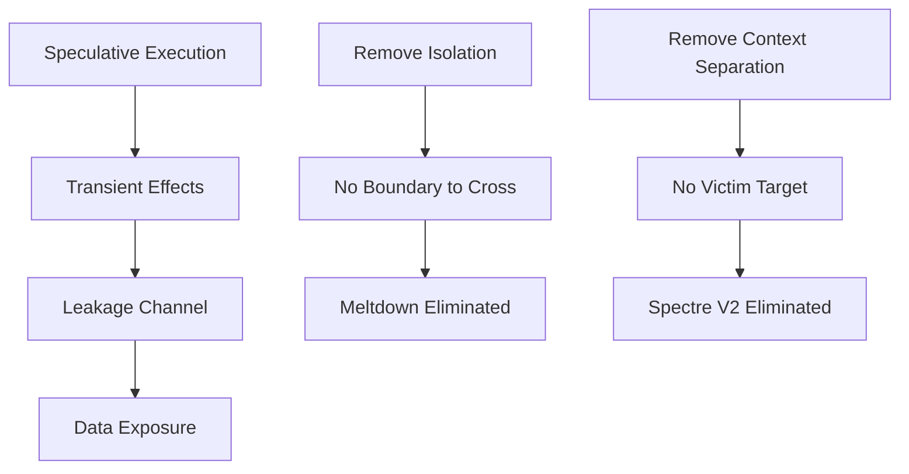

# Conclusion

!!! info "[Skip to TL;DR](#tldr)"

---

## Summary of Findings

This work evaluated the applicability of **Meltdown** and **Spectre** on a **64-bit RISC-V microcontroller** by analyzing required architectural preconditions and mapped them to the implemented design.[^1][^2][^3]

The results show that vulnerability is not determined solely by:

* Speculative execution
* Pipeline depth
* Cache hierarchy

but by the **interaction between execution, isolation, and observability**.

---

## Meltdown

* Requires:
    * Hardware-enforced privilege boundary
    * Page fault mechanism
    * Deferred exception handling

* In the analyzed design:
    * No privilege separation
    * No virtual memory
    * No page faults

??? note
The fundamental condition required to create a transient fault window is absent.

**Result:**

* Meltdown is **structurally impossible**[^1]

---

## Spectre

### Variant 2 (BTB Injection)

* Requires:
    * Separate execution contexts
    * Shared predictor state

**Result:**

* Not applicable due to absence of context isolation

---

### Variant 1 (Bounds Check Bypass)

* Requires:
    * Predictable branch
    * Shared cache
    * Isolation boundary

**Result:**

* Not applicable in single trust domain
* **Conditionally possible** in multi-component software systems[^2]

??? warning
    The hardware does not prevent cross-component leakage when software isolation is absent.

---

## Cache Timing Side-Channel

* Cache is:
    * Present
    * Shared
    * Timing observable

**Result:**

* Side-channel remains **fully functional**

---

## Architectural Interpretation

The microcontroller demonstrates:

* **Immunity to Meltdown**
* **Elimination of Spectre V2 attack surface**
* **Reduced Spectre V1 scope**
* **Retention of timing side-channels**

This is achieved not through mitigation, but through **absence of required attack preconditions**.

---

## Design Insight

---

## Security Trade-off

The design reflects a fundamental trade-off:

| Aspect                  | Effect                    |
| ----------------------- | ------------------------- |
| No privilege separation | Eliminates Meltdown       |
| No virtual memory       | Removes protected regions |
| Shared cache            | Enables side-channel      |
| OoO execution           | Enables speculation       |

??? note
    Security is achieved by reducing architectural complexity rather than adding defensive mechanisms.

---

## Practical Implications

* For **bare-metal microcontrollers**:
    * Meltdown-class attacks are irrelevant
    * Spectre risk depends on software architecture

* For **multi-component systems**:
    * Software must enforce isolation
    * Side-channel-aware design is required

---

## Final Insight

> Transient execution vulnerabilities are not universal flaws in speculative execution—they are consequences of combining speculation with isolation boundaries and observable microarchitectural state.

---

## TL;DR

* Meltdown → Not applicable
    * No privilege boundary
    * No page fault mechanism

* Spectre V2 → Not applicable
    * No separate execution context

* Spectre V1 → Conditionally possible
    * Only with shared software components

* Cache timing side-channel → Present

* Core takeaway:
    * Vulnerability = **Speculation + Isolation + Observability**

!!! info ""
    The analyzed RISC-V microcontroller achieves security through architectural minimalism, eliminating attack preconditions rather than mitigating them.

---
[^1]: Lipp et al., *Meltdown*, USENIX Security 2018. [→ References](../references.md#ref-1)
[^2]: Kocher et al., *Spectre Attacks*, IEEE S&P 2019. [→ References](../references.md#ref-2)
[^3]: RISC-V International, *Privileged Architecture Manual v20211203*. [→ References](../references.md#ref-3)
[^6]: Gruss et al., *Flush+Flush*, DIMVA 2016. [→ References](../references.md#ref-6)