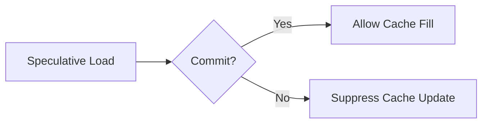
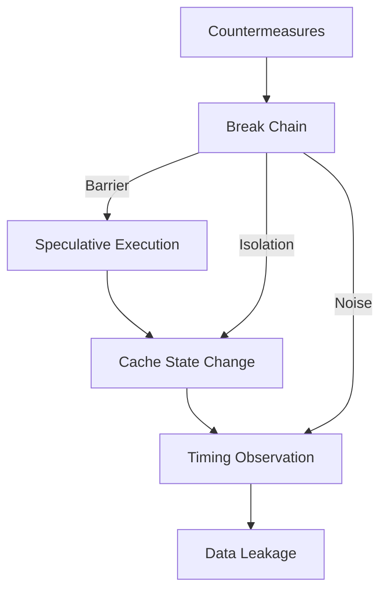

# Countermeasures

!!! info "[Skip to TL;DR](#tldr)"

---

## Context

Although Meltdown is not applicable to the analyzed RISC-V microcontroller, **Spectre-class behavior and cache timing side-channels remain relevant**.

This section presents:

* Countermeasures applicable to the **target microcontroller design**
* Reference countermeasures used in **privileged processors** for comparison[^5][^1][^2]

---

## Design Perspective

The microcontroller achieves immunity to Meltdown and Spectre V2 **by design**, not by mitigation:

* No privilege boundary → no Meltdown
* No context separation → no Spectre V2

However:

* Speculative execution → present
* Branch prediction → present
* Cache side-channel → present

Therefore:

* **Spectre V1 and timing leakage must be mitigated**

??? note
    Countermeasures focus on reducing speculation-based leakage and side-channel observability.

---

## Countermeasures for This Design

### 1. Speculation Barriers (Fence Instructions)

#### Mechanism

* Use RISC-V:

    * `fence` → serializes memory operations
    * `fence.i` → serializes instruction fetch

#### Effect

* Prevents speculative execution beyond the barrier
* Forces pipeline to resolve prior instructions

```c {#m2x1o3}
if (x < size) {
    asm volatile ("fence");
    val = array[x];
}
```

??? warning
    Overuse introduces pipeline stalls and performance degradation.

---

### 2. Index Masking (Branch Elimination)

#### Mechanism

Replace:

```c {#tv2xyo}
if (x < size)
    val = array[x];
```

With:

```c {#0v6vwd}
x = x & (size - 1);
val = array[x];
```

#### Effect

* Eliminates conditional branch
* Removes branch predictor dependency
* Prevents misprediction-based leakage

??? tip
    Effective for power-of-two array sizes.

---

### 3. Constant-Time Access Patterns

#### Mechanism

* Access all possible elements regardless of condition
* Use arithmetic masking instead of branching

#### Effect

* Removes data-dependent timing variation
* Prevents cache-based inference

??? note
    Common in cryptographic implementations.

---

### 4. Restrict High-Resolution Timers

#### Mechanism

* Disable user access to cycle counter:

```c {#zq2w9k}
// mcounteren.CY = 0 (machine configuration)
```

#### Effect

* Reduces timing resolution
* Makes cache timing attacks less reliable

??? warning
    Does not eliminate side-channel—only increases noise.

---

### 5. Cache Partitioning (Hardware)

#### Mechanism

* Partition cache ways between software components

Example:

* 2-way cache → assign 1 way per task

#### Effect

* Prevents cross-component cache observation
* Eliminates shared cache channel

??? warning
    Requires hardware modification to cache controller.

---

## Microarchitectural Countermeasure (Design-Level)

### Suppress Cache Fill on Speculative Instructions

#### Mechanism

* Prevent cache updates from instructions that:

    * Are executed speculatively
    * Are later flushed (ROB discard)



#### Effect

* Eliminates leakage from transient execution
* Breaks Meltdown/Spectre exfiltration channel

??? tip
    This is a hardware-level mitigation aligning microarchitectural state with architectural commit.

---

## Applicability Summary (This Design)

| Countermeasure                | Target       | Effectiveness |
| ----------------------------- | ------------ | ------------- |
| Fence instructions            | Spectre V1   | High          |
| Index masking                 | Spectre V1   | High          |
| Constant-time access          | Side-channel | High          |
| Timer restriction             | Side-channel | Medium        |
| Cache partitioning            | Side-channel | High          |
| Speculative cache suppression | All          | Very high     |

---

## Reference Countermeasures (Privileged CPUs)

These are not required for the current design but provide context.

---

### 1. KPTI (Kernel Page Table Isolation)[^5]

#### Mechanism

* Separate user and kernel page tables
* Remove kernel mappings from user space

#### Effect

* Prevents Meltdown by eliminating mapped kernel pages

??? warning
Introduces TLB flush overhead on context switches.

---

### 2. Retpoline[^5]

#### Mechanism

* Replace indirect branches with return-based trampolines

#### Effect

* Prevents BTB poisoning (Spectre V2)

---

### 3. IBRS / IBPB / STIBP[^5]

#### Mechanism

* Restrict sharing of branch predictor state across contexts

#### Effect

* Mitigates cross-privilege speculation

---

### 4. LFENCE Serialization

#### Mechanism

* Insert serialization barrier after bounds checks

#### Effect

* Prevents speculative execution past critical checks

---

### 5. Hardware Redesign (Post-2019 CPUs)

#### Mechanism

* Predictor isolation
* Speculation restrictions in hardware

#### Effect

* Eliminates need for software workarounds

---

## Design Insight



* Countermeasures operate by breaking **any link in the leakage chain**

---

## Key Observations

* Eliminating **privilege boundary** removes Meltdown
* Eliminating **branch misprediction influence** reduces Spectre
* Eliminating **cache observability** removes leakage

??? note
    Complete security requires addressing all three dimensions: execution, isolation, and observability.

---

## TL;DR

* Meltdown → no mitigation required (not applicable)

* Spectre V1 → mitigate via:
    * Fence instructions
    * Index masking
    * Constant-time access

* Cache side-channel → mitigate via:
    * Timer restriction
    * Cache partitioning

* Strongest defense:
    * Suppress cache updates from speculative execution

!!! info ""
    The most effective countermeasure is architectural: aligning microarchitectural state changes with instruction commit semantics.

---
[^1]: Lipp et al., *Meltdown*, USENIX Security 2018. [→ References](../references.md#ref-1)
[^2]: Kocher et al., *Spectre Attacks*, IEEE S&P 2019. [→ References](../references.md#ref-2)
[^3]: RISC-V International, *Privileged Architecture Manual v20211203*. [→ References](../references.md#ref-3)
[^4]: RISC-V International, *Zicbom Extension v1.0*. [→ References](../references.md#ref-4)
[^5]: Intel Corporation, *Analysis of Speculative Execution Side Channels*, 2018. [→ References](../references.md#ref-5)